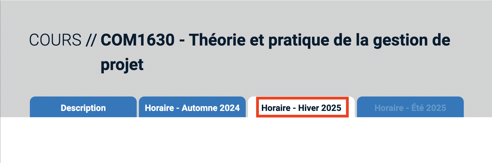

# UQAM Course Availability Notifier

## Description
This project is a **web scraper** designed to monitor course availability at UQAM. Once one or multiple groups have available places, the scraper sends an email notification. It continuously checks for updates at a user-defined interval and stops running as soon as an available group is found.

## Features
- Scrapes UQAM course registration system for updates.
- Sends email notifications when a course becomes available.
- Runs in a loop with a customizable interval.
- Stops execution automatically upon finding an available group.

---

## How to Run the Project

### Prerequisites
- Ensure Python 3.8+ is installed on your system.
```bash
python3 --version
```

### Install dependencies
- Create a new venv and activate it.

```bash
python3 -m venv .venv
```
```bash
source .venv/bin/activate
```

- Install necessary Python packages using the provided `requirements.txt`.

```bash
pip install -r requirements.txt
```
- Install Playwright.
```bash
playwright install
```
### Setup an SMTP Service
To send an email, you must have an SMTP Service. Personnaly, I use MailerSend. You can find the documentation to create a domain [here](https://www.mailersend.com/help/smtp-relay?_gl=1*1q3jnvu*_up*MQ..*_gs*MQ..&gclid=CjwKCAiApY-7BhBjEiwAQMrrERvb2CLHLKRnY1fGzWjj1rFuYJM0o9FWyKP01Bbdl7ghr9xEg2mx6xoCotIQAvD_BwE).

### Setup Environment Variables
Create a `.env` file in the root directory with the following variables:

```
SENDER_EMAIL=<SENDER_EMAIL>
RECEIVER_EMAIL=<RECEIVER_EMAIL>
EMAIL_PASSWORD=<EMAIL_PASSWORD>
SMTP_SERVER=<SMTP_SERVER>
SMTP_PORT=<SMTP_PORT>

COURSE_URL=https://etudier.uqam.ca/cours?sigle=inf1132&p=7316
COURSE_ACRONYM=INF1132
COURSE_NAME="Mathématiques pour l'informatique"

# Session name written in the tab (ex: Horaire - Automne 2024)
SESSION="Horaire - Automne 2024"

# Time interval in seconds
TIME_INTERVAL=3
```
**The session variable is to select the session wanted. The text must be the 
same as the one in the blue tab.**

### Running the Project
Run the Python script using the following command:

```bash
python3 main.py
```
***You must activate the python env in order to start the project.***

---

## Running on a Raspberry Pi

This project is optimized to run on a Raspberry Pi for 24/7 availability.

I tried to run the project with raspbian but it doesn't work. 

Personally, I use Ubuntu.

---

## Technologies Used
- **BeautifulSoup4**: For web scraping and parsing HTML content.
- **Playwright-Python**: For automating and interacting with the browser.
- **dotenv**: For managing environment variables securely.

---

## Notes
- Test the script periodically to ensure compatibility with UQAM’s website updates. If the Uqam website is updated, you can change modify the file `pwFindContent.py`.

## Disclaimer

This application is provided "as is," without any warranty of any kind. The author assumes no responsibility or liability for any errors, omissions, or outcomes resulting from the use of this application. 

By using this application, you agree to do so at your own risk. The author shall not be held liable for any damages, losses, or other consequences arising from its use, whether direct or indirect.

Please ensure that you understand and comply with all applicable laws and guidelines while using this application.
